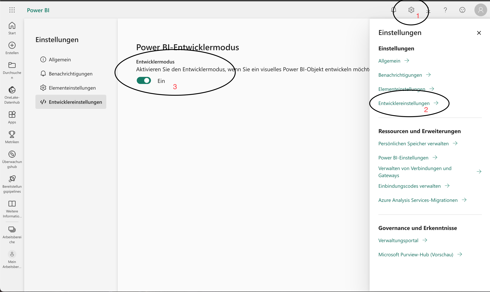
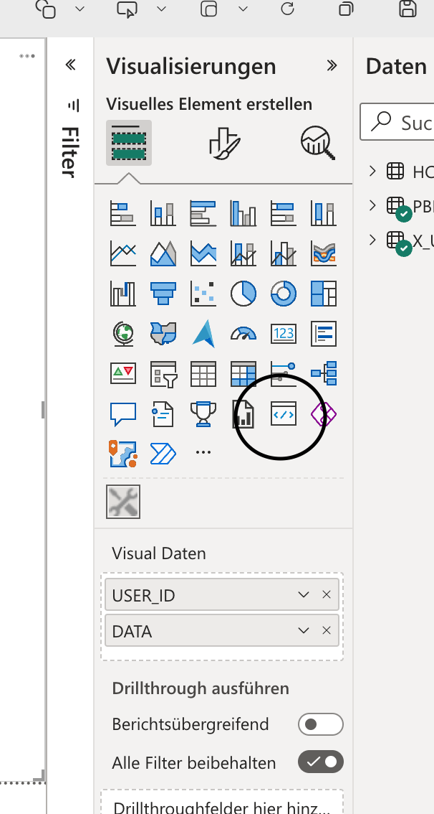

# PowerBI Custom Visual

Eine _Deutsche_ Vorlage für ein PowerBI Custom Visual. Enthält verbesserte Grundkonfiguration, vorinstallierte Pakete und Dokumentation.

## Installationen

Befolge folgende Schritte um alle Voraussetzungen für die Weiterentwicklung des Projektes zu erfüllen.

-   Installiere `node` in der Version `18.12.0`
-   Installiere `yarn` global: `npm install -g yarn`
-   Installiere alle Projektabhängigkeiten im Projektverzeichnis: `yarn install`
-   Installiere ein lokales SSL-Zertifikat: `yarn cert`
-   Optional: Installiere VSCode
-   Optional: Installiere alle empfohlenen VSCode Erweiterungen: `Öffne das Projektverzeichnis mit VSCode` -> `Warte auf die Meldungen, dass das Projekt empfohlene Erweiterungen habe` -> `Klicke auf Installieren` (Die Empfehlungen sind unter `/.vscode/extensions.json` definiert)

## Visual konfigurieren

Nach dem Kopieren dieser Vorlage, sollten einige Einstellungen geändert werden.

### pbiviz.json

In der [/pbiviz.json](./pbiviz.json) werden allgemeine Metadaten zum Custom Visual festgelegt.
Folgende Werte müssen angepasst werden:

-   `displayName`: Der Name des Visuals, welcher dem Benutzer angezeigt wird.
-   `guid`: Eine eindeutige ID. Kann auf [guid.one](https://guid.one) generiert werden. **Achtung: Bindestriche müssen entfernt werden.**
-   `description`: Eine kurze Beschreibung des Visuals.
-   `author`: Informationen zu Deiner Person.
-   `assets`: Legt das Icon des Visuals fest. Standardmäßig ist dieses unter [/assets/icon.png](./assets/icon.png) zu finden. Gute Icons können auf [Material Icons](https://fonts.google.com/icons?icon.set=Material+Icons) als `.png` heruntergeladen werden.

### capabilities.json

In der [/capabilities.json](./capabilities.json) gibt es ganz unten den Punkt `WebAccess`. Im Array `parameters` sind alle externen URLs einzutragen, welche das Visual abfrägt.

Beispiel:

```
...
    "privileges": [
        {
            "name": "WebAccess",
            "essential": true,
            "parameters": ["https://*.openstreetmap.org"]
        }
    ]
...
```

## Projekt bauen

Nutze `yarn build` um ein deploybares Visual für PowerBI zu erhalten.

## Entwicklersetup

### PowerBI vorbereiten

Jeder Entwickler muss in seinen eigenen PowerBI Einstellungen den Entwicklermodus aktivieren.



Nun kann auf einen beliebigen Bericht das Entwickler-Visual platziert werden.



### Entwicklermodus starten

```
yarn serve
```

Dieser Befehl startet einen lokalen Server, welcher Hot-Reload beim Speichern von Dateien im Projekt unterstützt.
In einem PowerBI Bericht kann nun das Entwickler-Visual hinzufügt werden. So ist es möglich das Visual ohne Deployment zu testen.

### Zertifikat im Browser erlauben

Nachdem man das Tutorial für das Dev-Setup gemacht hat, sollte ein localhost-Zertifikat installiert sein.
Der Edge-Browser akzeptiert dieses jedoch nicht.
Unter `edge://flags` kann man `localhost` eingeben und die Option für das localhost-Zertifikat erlauben.

-   Startseite
-   News
-   Issor

## Projektstruktur

-   `src/component`: React-Komponenten zur Darstellung von UI
-   `src/data`: Recoil-Atome und -Selektoren um Daten-Aggregation zu vereinfachen
-   `src/hook`: React-Hooks um logische Abläufe zu vereinfachen
-   `src/loc`: Lokalisierungen (aktuell nur Deutsch)
-   `src/model`: Alle Entitäten welche das Projekt nutzt
-   `src/style`: Globales Styling
-   `src/util`: Hilfsfunktionen
-   `visual.tsx`: Programmatischer Einstiegspunkt ins Visual
-   `assets`: Bilder und Dateien, welche im Projekt verwendet werden
-   `docs`: Dokumentierung und Beispielbilder

## Drittanbieter-Bibliotheken

Alle installierten Bibliotheken finden sich unter `package.json` -> `dependencies`.

-   `@emotion`: CSS in JS
-   `@fontsource`: Fonts
-   `@mui`: UI-Bibliothek mit fertigen React-Komponenten
-   `dayjs`: Arbeiten mit Datumen
-   `lodash`: Hilfsfunktionen
-   `powerbi`: Brücke zu PowerBI-Funktionalitäten
-   `react`: Rendering von UI
-   `recoil`: Zentrales Datenmanagement
-   `rooks`: Hilfsfunktionen für React
